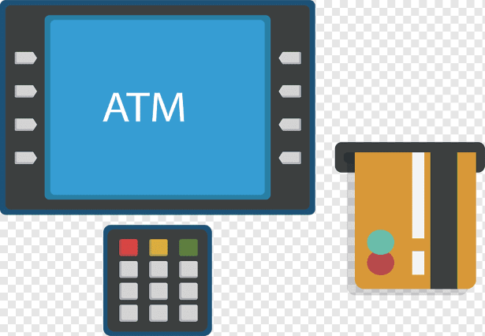

# ATM-Exercise
https://jovinjp.github.io/ATM-Exercise/

<h2>Description</h2>

This is an ATM exercise which will allow the user(s) to deposit and withdraw money back and forth. As you deposit and withdraw the cash, the atm will update the balance as you press "submit".

<h2>Outcome</h2>

If you deposit a certain amount and you want to withdraw more than your balance, the submit button wi ll not work; it will not let you overdrawn.

<h2>Future Improvements</h2>

The codes can be re-use and set a way that the user(s) could withdraw more than the balance and be overdrawn.
 
<h2>Credit</h2>

MIT xPRO

